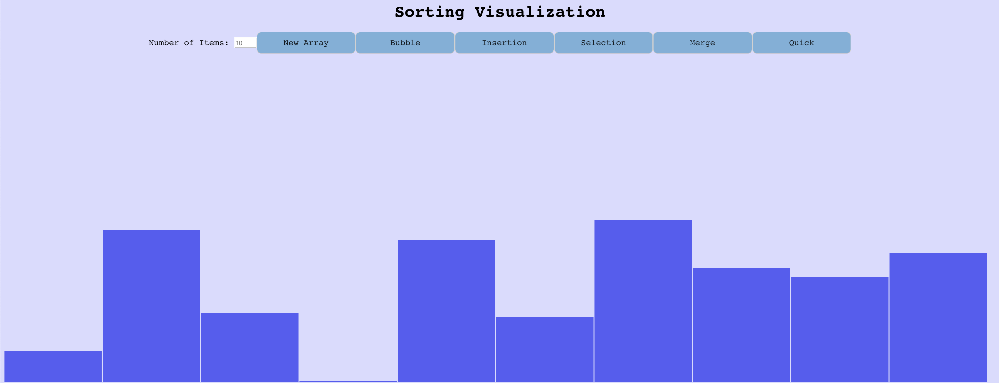

# Common Sorting Algorithms
Graphical demonstration of sorting algorithms.

### How to Use:
Go to `https://inventshah.github.io/Sorting/`

Or run locally: `git clone https://github.com/inventshah/Sorting.git` and open the `index.html` file.

The demonstration starts with an array of 10 random values.

Press any of the sort buttons to see the method sort the set of values. Press `New Array` to generate a new set of random values or enter a different `Number of Items`.

### Built With:
- JavaScript
- React
- HTML / CSS